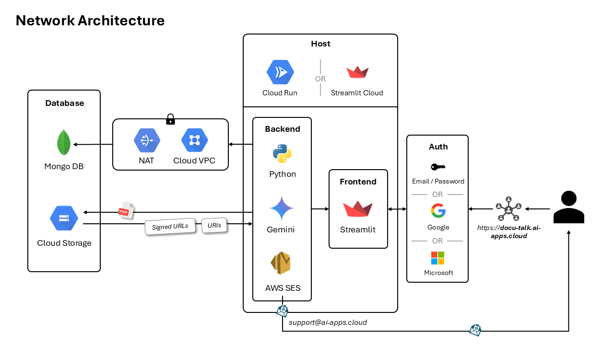

# Docu Talk

Docu Talk is an AI-powered platform that allows you to **create custom chatbots based on your own documents**. 

- **Create custom chatbots** in less than a minute
- **Sharing**: Invite others to access your Chat Bots
- **AI Expertise**: Get precise answers with source identification functionality
- **Easy to use**: Enjoy a clear, simple, and user-friendly interface

https://github.com/user-attachments/assets/6a03b0a1-a549-4e58-9576-2ee25e0b6ba1

## Network Architecture

### Database

The application relies on a database composed of **MongoDB** and **Cloud Storage**.

**MongoDB** contains the core database of the application, such as access data, created chatbots, and consumed usage (see section X). The connection between the back-end and the MongoDB database is established through a **VPC/NAT configuration**, allowing the container to communicate externally with a static IP whitelisted by MongoDB Atlas, thus preserving the security of the internal network.

**Cloud Storage** is used to store large files, i.e PDFs uploaded by users. Cloud Storage returns **signed and secure URLs** that enable users to access their documents through the application. Finally, Cloud Storage integrates with Gemini by providing only **the URIs** of the documents without needing to read them from the back-end.

### Back-end & Front-end

The back-end and front-end are deployed in a single container, using **Python** as the programming language.

The back-end uses **Gemini** as a generation model that directly interacts with the URIs of the uploaded documents. An **Amazon Web Services SES** service is also deployed to handle email sending to users.

The front-end is built using the **Streamlit** framework.

### Hosting

The application is hosted on Cloud Run and mapped to the domain **docu-talk.ai-apps.cloud**.

## MongoDB Database

The MongoDB database contains the majority of the data stored by the application. It is composed of 10 tables that facilitate the management of user access, chatbots and their documents, and consumed usage.

* **Users**: A collection of users with access to the application, identified by their email addresses. The table securely stores hashed user passwords using `bcrypt`.
* **Chatbots**: Chatbots created by users, including their title, description, and icon. The `access` field indicates whether the chatbot is public or private.
* **Access**: A table that indicates which user has access to which chatbot and the corresponding role, which can be either "Admin" or "User."
* **Documents**: A collection of PDF documents uploaded by users, including storage information on Cloud Storage (URI).
* **SuggestedPrompts**: A collection of suggested prompts for each existing chatbot.
* **Usage**: A table indicating the usage consumed by users, broken down by the model used.
* **ServiceModels**: A collection of available generation models along with their pricing levels.

The **AskChatbotTokenCounts**, **AskChatbotDurations**, and **CreateChatbotDurations** tables are used to log various metrics. These metrics are frequently used to retrain Machine Learning models to estimate waiting times or credits consumed before executing different processes.
